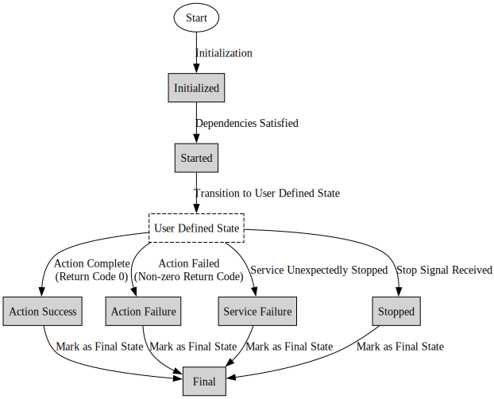

# Shepherd - Shepherd - A Local Workflow Manager and Service Orchestration Tool

Shepherd is designed to manage local workflows that involve both actions that run to completion and services that persist until explicitly stopped. It tracks the internal states of services by analyzing log outputs and file contents, allowing it to manage complex workflows with ease. Shepherd treats services as tasks, enabling them to be seamlessly integrated into larger distributed workflows. By monitoring the internal states of services, Shepherd ensures that dependencies are met and services are gracefully shut down when required.

Shepherd is particularly useful for applications that require persistent services as part of a traditional task-based workflow. For example, consider a scenario where a web server should start only after the database service has completed its initialization and is ready to handle queries. The database does not perform a single action that completes; instead, it reaches an internal state that should dynamically trigger the launch of the web server. Shepherd can monitor the database service's logs for a message indicating successful startup. Upon detecting this state, Shepherd triggers the initiation of the web server, ensuring efficient workflow execution. Moreover, Shepherd wraps the entire service workflow into a single task that terminates upon completion, making it easy to integrate into larger task-based workflows.

## Key Features
- **Services as Tasks:** Shepherd treats persistent services as first-class tasks within a workflow, enabling them to be seamlessly integrated into traditional task-based workflow managers.

- **Dependency Management:** Shepherd allows tasks (both actions and services) to start based on the internal states of other services or actions, enabling complex state-based dependencies. It supports `any` and `all` dependency modes, allowing for flexible dependency configurations.

- **State Monitoring:** Shepherd continuously monitors the internal state of each application by analyzing standard output and the contents of any specified files. It updates the state in real-time based on specific keywords found in these files. This allows Shepherd to manage workflows with dynamic state transitions.

- **Graceful Startup and Shutdown:** Shepherd ensures services start only when their dependencies are met and provides controlled shutdown mechanisms to prevent data loss and ensure system stability.

- **Robust Logging and Visualization:** Shepherd generates comprehensive logs and state transition data, which can be used to create visualizations of the workflow execution, aiding in performance analysis and debugging.

- **Integration with Larger Workflows:** By encapsulating service workflows into single tasks, Shepherd enables easy integration with larger distributed workflow managers like Makeflow, enhancing workflow flexibility and reliability.


## Program State Transition Overview

The Shepherd tool manages program execution through a series of defined states, ensuring dependencies are met and  states are recorded. Every program has default states (`Initialized`, `Started`, and `Final`) and can have optional user-defined states. Programs transition from `Initialized` to `Started` once dependencies are satisfied, then move through user-defined states. Actions return `Action Success` on a zero return code and `Action Failure` otherwise, while services  transition to `Service Failure` if they stop unexpectedly. Any program receiving a stop signal is marked as `Stopped`, and all programs ultimately transition to a `Final` state, reflecting their execution outcome.



## Installation

To install Shepherd, clone the repository and install using pip:

```bash
git clone https://github.com/cooperative-computing-lab/shepherd.git
cd shepherd
pip install .
```

Optionally, create a virtual environment before installing Shepherd to avoid conflicts with other Python packages:

```bash
python3 -m venv venv
source venv/bin/activate
pip install .
```


## Getting Started with Shepherd: A Hello World Example
Shepherd simplifies complex application workflows. Here’s a simple example to demonstrate how to use Shepherd for 
scheduling dependent programs. In this example, we have two shell scripts: `program1.sh` and `program2.sh`.  `program2` should start only after `program1` has successfully completed its execution.

#### 1. Create Sample Scripts

Create two shell scripts named `program1.sh` and `program2.sh` with the following content:

```shell
#!/bin/bash

echo "Starting program..."
sleep 5
echo "Program completed"
```

Make sure to make the scripts executable:
  
  ```shell 
  chmod +x program1.sh program2.sh
  ```

#### 2. Create a Shepherd Configuration File
Create a Shepherd configuration file named `shepherd-config.yml` with the following content:

```yaml
tasks:
  program1:
    command: "./program1.sh"
  program2:
    command: "./program2.sh"
    dependency:
      items:
        program1: "action_success"  # Start program2 only after program1 succeeds
output:
  state_times: "state_transition_times.json"
max_run_time: 60  # Optional: Limit total runtime to 60 seconds
```

#### 3. Run Shepherd
Run Shepherd with the configuration file:
```shell
shepherd -c shepherd-config.yml
```

If you are running the python source, then run
```shell
python3 shepherd.py -c shepherd-config.yml
```

If you are running shepherd executable, then run
```shell
shepherd -c shepherd-config.yml
```

#### Understanding the workflow
With this simple configuration, Shepherd will:
1. Execute `program1.sh`.
2. Monitor the internal states of the program.
3. Start `program2.sh` only after `program1.sh `succeeds.
4. Create `state_transition_times.json`, which will look similar to this:

```json
{
  "my_service": {
    "initialized": 0.19824790954589844,
    "started": 0.19916582107543945,
    "ready": 5.461252927780151,
    "stopped": 60.36078095436096,
    "final": 60.36192083358765
  },
  "my_action": {
    "initialized": 0.20003700256347656,
    "started": 5.466093063354492,
    "action_success": 10.657495021820068,
    "final": 10.658098936080933
  }
}
```

## Monitoring User-Defined States in Shepherd
Shepherd can monitor standard output (stdout) or any other file to detect user-defined states. These states can then be used as dependencies for other programs. This feature allows you to define complex workflows based on custom application states.

#### Example Scenario: Dynamic Dependencies
Suppose you have a service that becomes 'ready' after some initialization, and other tasks depend on it being ready.

Example Service script (`service.sh`):

```bash
#!/bin/bash

echo "Service is starting..."
sleep 5
echo "Service is ready"
tail -f /dev/null  # Keep the service running
```

Action script (`action.sh`):
```bash
#!/bin/bash

echo "Action is running..."
sleep 5
echo "Action completed"
```

Make sure to make the scripts executable:
  
  ```shell 
  chmod +x service.sh action.sh
  ```

#### Shepherd Configuration with user-defined states
Below is a Shepherd configuration file that monitors the standard output of the service script to detect the 'ready' state. The action script starts only after the service is ready.

```yaml
tasks:
  my_service:
    type: "service"
    command: "./service.sh"
    state:
      log:
        ready: "Service is ready"
  my_action:
    type: "action"
    command: "./action.sh"
    dependency:
      items:
        my_service: "ready"
output:
  state_times: "state_transition_times.json"
max_run_time: 60
```

#### How This Configuration Works
1. Shepherd starts the service script `service.sh`.
2. Shepherd monitors the standard output of the service script for the message "Service is ready".
3. Once the service is ready, Shepherd starts the action script `action.sh`.
4. Shepherd creates `state_transition_times.json` with the state transition times.

```json
{
  "my_service": {
    "initialized": 0.25,
    "started": 0.26,
    "ready": 5.35,
    "stopped": 65.00,
    "final": 65.01
  },
  "my_action": {
    "initialized": 5.36,
    "started": 5.37,
    "action_success": 10.40,
    "final": 10.41
  }
}
```

## Configuration Options
Shepherd uses a YAML configuration file to define the workflow. Here are some key configuration options:

### Defining Tasks
Tasks are defined under the tasks section. Each task can be an action or a service:

- **Action:** A task that runs to completion and exits.
- **Service:** A persistent application that runs until explicitly stopped.

The default type is action. Here is an example configuration with an action and a service:

```yaml
tasks:
  my_action:
    type: "action"
    command: "python process_data.py"
  my_service:
    type: "service"
    command: "start_server.sh"
```

### Dependencies
Dependencies specify when a task should start, based on the states of other tasks.

- **Mode:** Specifies whether all dependencies must be met (`all`, the default) or any one (`any`).

```yaml
tasks:
  task2:
    type: "action"
    command: "./task2.sh"
    dependency:
      mode: "all"
      items:
        task1: "action_success"
        task3: "ready"
```

### Monitoring User-Defined States
Shepherd can monitor standard output or files to detect user-defined states. This allows you to control the workflow based on custom application states.

Example of monitoring standard output:
```yaml
tasks:
  my_program:
    command: "./my_program.sh"
    state:
      log:
        ready: "program is ready"
        complete: "program is completed"
```

Example of monitoring a file:

```yaml
tasks:
  my_task:
    type: "action"
    command: "./my_task.sh"
    state:
      file:
        path: "/tmp/my_task_state.log"
        states:
          completed: "Task completed successfully"
```

### Output Options
Shepherd can generate output files containing state transition times and other logs. You can specify the output file paths in the configuration:

```yaml
output:
  state_times: "state_transition_times.json"
  stdout: "stdout.log"
  stderr: "stderr.log"
```

### Shutdown Conditions
Shepherd can be configured to stop all tasks based on specific conditions, such as a stop signal, maximum runtime, or success criteria:

- **Stop Signal:** A file that, when created, triggers a controlled shutdown.
- **Max Run Time:** The maximum runtime for the entire workflow.
- **Success Criteria:** Criteria that, when met, trigger a shutdown.

```yaml
stop_signal: "/tmp/shepherd_stop"
max_run_time: 120
success_criteria:
  mode: "all"
  items:
    task1: "action_success"
    task2: "action_success"
```

Only one of these conditions needs to be met for Shepherd to initiate a controlled shutdown.
